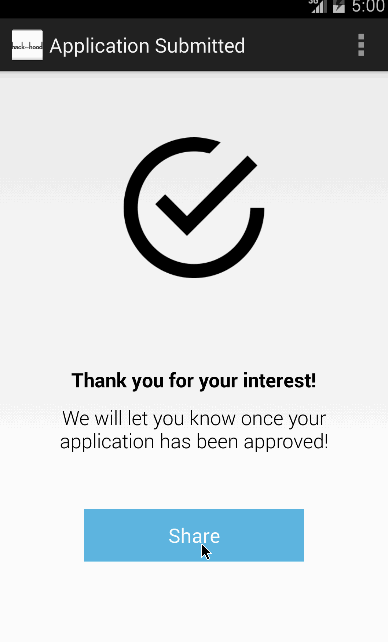

# Overview
Hack the Hood is a non-profit organization that helps economically disadvantaged youths to learn web development by connecting them with local small businesses that need web sites.

Problems the charity faces are:

1. signing up businesses; and
2. ensuring necessary assets are made available to the student by the businesses.

# Completed User Stories
## A pitch deck is shown; users can sign up or log in if previously signed up

## User can submit their application to join the programme

## User can share their status

# User Stories
* charity employees can add businesses to the program;
* businesses can see the current status of their site;
* businesses can see a list of required assets, each of which may be:
 * a multiple-choice answer (with a write-in option);
 * their selection from a fixed menu;
 * a short amount of text; or
 * an image;
* businesses can supply assets by (where applicable):
 * typing;
 * selecting an image from their phone library; or
 * taking a new photo.

## Optional
* businesses can apply for consideration of their own volition;
* attract screen, including:
 * what the charity does;
 * student testimonials;
 * nearby businesses that have signed up;
* students can add to list of required assets;
* text assets can be input using voice recognition;
* businesses can see work-in-progress version of their web sites, can annotate to provide feedback.
